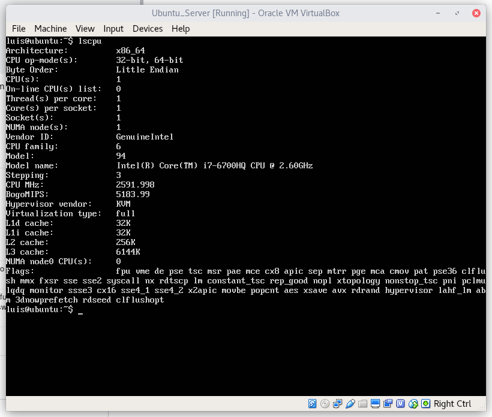
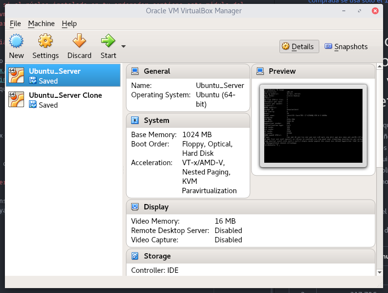
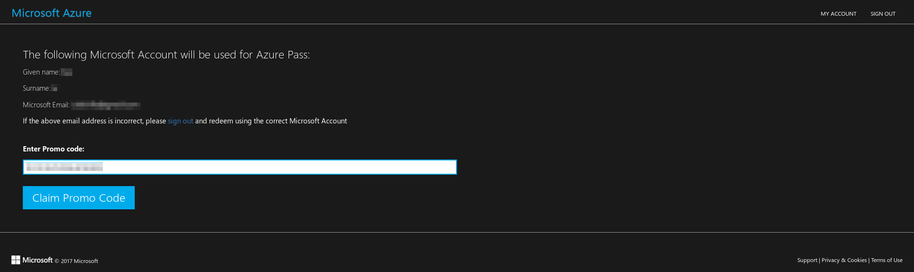
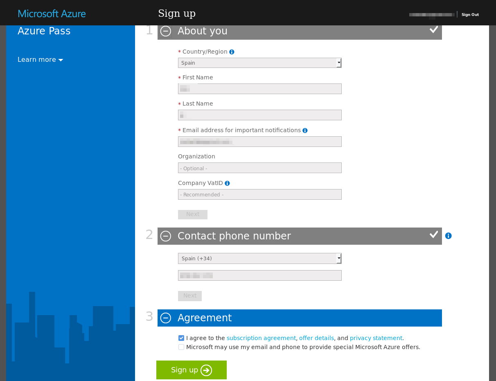
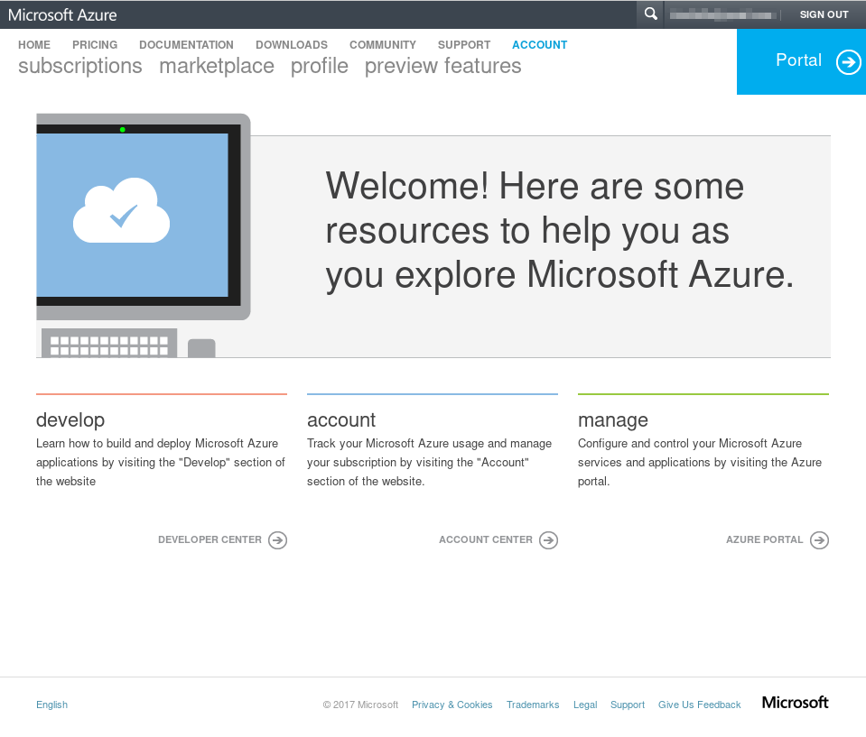
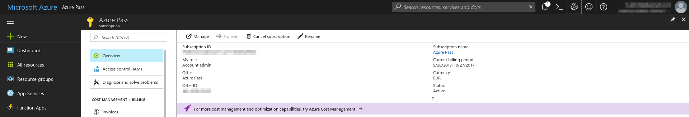
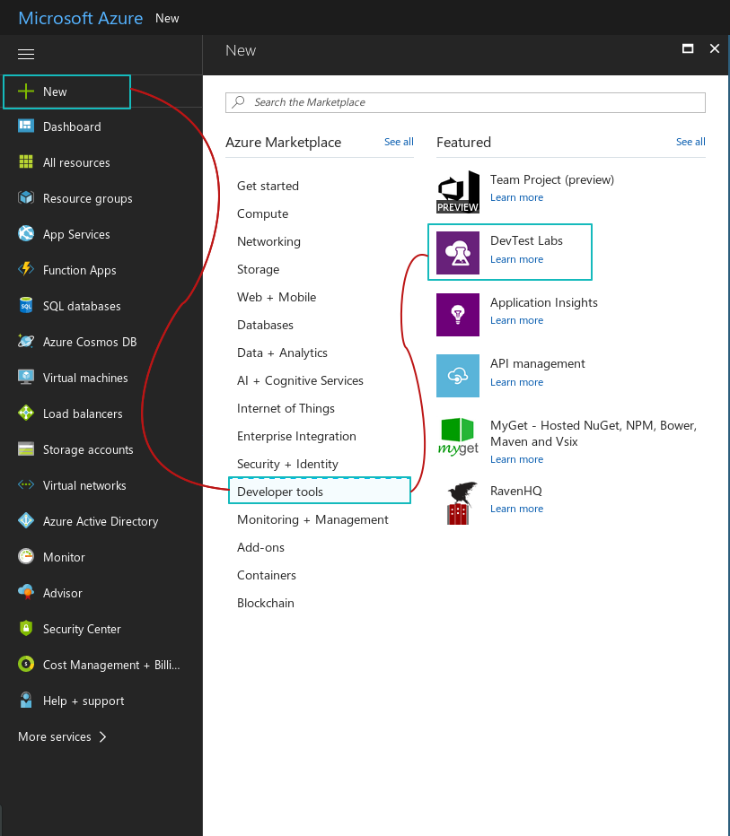
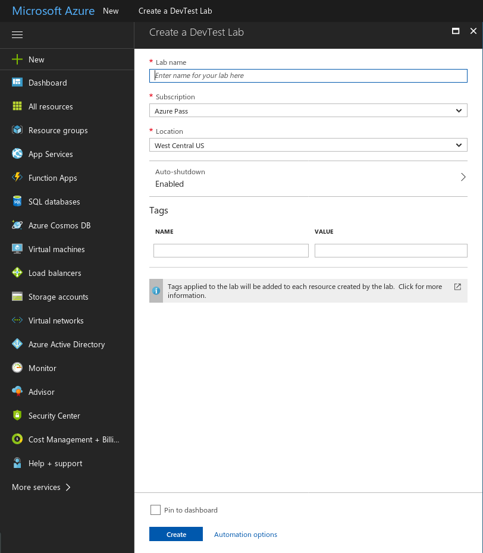

# Ejercicios propuestos del tema 1

## TOC
<!-- TOC depthFrom:3 depthTo:9 withLinks:1 updateOnSave:0 orderedList:1 -->

1. [Consultar en el catálogo de alguna tienda de informática el precio de un ordenador tipo servidor y calcular su coste de amortización a cuatro y siete años.](#ejercicio-1-consultar-en-el-catlogo-de-alguna-tienda-de-informtica-el-precio-de-un-ordenador-tipo-servidor-y-calcular-su-coste-de-amortizacin-a-cuatro-y-siete-aos)
2. [Usando las tablas de precios de servicios de alojamiento en Internet y de proveedores de servicios en la nube, Comparar el coste durante un año de un ordenador con un procesador estándar (escogerlo de forma que sea el mismo tipo de procesador en los dos vendedores) y con el resto de las características similares (tamaño de disco duro equivalente a transferencia de disco duro) en el caso de que la infraestructura comprada se usa sólo el 1% o el 10% del tiempo.](#ejercicio-2-usando-las-tablas-de-precios-de-servicios-de-alojamiento-en-internet-y-de-proveedores-de-servicios-en-la-nube-comparar-el-coste-durante-un-ao-de-un-ordenador-con-un-procesador-estndar-escogerlo-de-forma-que-sea-el-mismo-tipo-de-procesador-en-los-dos-vendedores-y-con-el-resto-de-las-caractersticas-similares-tamao-de-disco-duro-equivalente-a-transferencia-de-disco-duro-en-el-caso-de-que-la-infraestructura-comprada-se-usa-slo-el-1-o-el-10-del-tiempo)
3. [En general, cualquier ordenador con menos de 5 o 6 años tendrá estos flags. ¿Qué modelo de procesador es? ¿Qué aparece como salida de esa orden? Si usas una máquina virtual, ¿qué resultado da? ¿Y en una Raspberry Pi o, si tienes acceso, el procesador del móvil?](#ejercicio-3-en-general-cualquier-ordenador-con-menos-de-5-o-6-aos-tendr-estos-flags-qu-modelo-de-procesador-es-qu-aparece-como-salida-de-esa-orden-si-usas-una-mquina-virtual-qu-resultado-da-y-en-una-raspberry-pi-o-si-tienes-acceso-el-procesador-del-mvil)
4. [Comprobar si el núcleo instalado en tu ordenador contiene este módulo del kernel usando la orden kvm-ok. Instalar un hipervisor para gestionar máquinas virtuales, que más adelante se podrá usar en pruebas y ejercicios.](#ejercicio-4-comprobar-si-el-ncleo-instalado-en-tu-ordenador-contiene-este-mdulo-del-kernel-usando-la-orden-kvm-ok-instalar-un-hipervisor-para-gestionar-mquinas-virtuales-que-ms-adelante-se-podr-usar-en-pruebas-y-ejercicios)
	1. [Comprobar la existencia del módulo kvm](#comprobar-la-existencia-del-mdulo-kvm)
	2. [Instalación de un hipervisor para gestionar máquinas virtuales.](#instalacin-de-un-hipervisor-para-gestionar-mquinas-virtuales)
5. [Darse de alta en servicios de nube usando ofertas gratuitas o cupones que pueda proporcionar el profesor.](#ejercicio-5-darse-de-alta-en-servicios-de-nube-usando-ofertas-gratuitas-o-cupones-que-pueda-proporcionar-el-profesor)
6. [Darse de alta en una web que permita hacer pruebas con alguno de los sistemas de gestión de nube anteriores.](#ejercicio-6-darse-de-alta-en-una-web-que-permita-hacer-pruebas-con-alguno-de-los-sistemas-de-gestin-de-nube-anteriores)

<!-- /TOC -->

### Ejercicio 1: Consultar en el catálogo de alguna tienda de informática el precio de un ordenador tipo servidor y calcular su coste de amortización a cuatro y siete años.

Antes de nada debemos saber qué es y [cómo calcular una amortización](http://www.ennaranja.com/economia-facil/que-es-y-como-calcular-una-amortizacion/). En este caso supondremos que se trata de la sustitución de un bien a los 4 años y los 7 años, por lo que tendremos que dividir el valor del servidor (sin IVA) entre esos 4 y 7 años. Si consultamos la [tabla de amortizaciones simplificada](http://www.agenciatributaria.es/AEAT.internet/Inicio/_Segmentos_/Empresas_y_profesionales/Empresarios_individuales_y_profesionales/Rendimientos_de_actividades_economicas_en_el_IRPF/Regimenes_para_determinar_el_rendimiento_de_las_actividades_economicas/Estimacion_Directa_Simplificada.shtml), podemos ver que el coeficiente lineal máximo aplicable es de un 26% (en "Equipos para tratamiento de la información y sistemas y programas informáticos). En el caso de los 4 años supondrá aplicar un 25% y un 14,29% (aproximadamente) en el caso de los 7 años por lo que nos encontramos dentro del máximo aplicable. Para realizar este ejercicio, calcularemos la amortización a un [servidor](https://www.pccomponentes.com/hp-proliant-ml310e-g8-xe-e3-1220-8gb-2tb) de 796€ (635,54€ sin IVA).

Suponiendo que se adquieren el 1 de enero:

**Amortización a 4 años:**
Cuota de amortización: 158,89€ (redondeado hacia arriba)

| Año  | Amortización acumulada  | Valor  |
|:----:|:-----------------------:|:------:|
|1     |158,89€                  |476,65€ |
|2     |317,78€                  |317,76€ |
|3     |476,67€                  |158,87€ |
|4     |635,54€                  |0€      |


**Amortización a 7 años:**
Cuota de amortización: 90,79€ (redondeado hacia abajo)

| Año  | Amortización acumulada  | Valor  |
|:----:|:-----------------------:|:------:|
|1     |90,79€                   |544,75€ |
|2     |181,58€                  |453,96€ |
|3     |272.37€                  |363.17€ |
|4     |363,16€                  |272,38€ |
|5     |453,95€                  |181,59€ |
|6     |544,74€                  |90,8€   |
|7     |635,54€                  |0€      |

*(el valor del penúltimo año difiere un poco de la cuota de amortización por el redondeo)*

### Ejercicio 2: Usando las tablas de precios de servicios de alojamiento en Internet y de proveedores de servicios en la nube, Comparar el coste durante un año de un ordenador con un procesador estándar (escogerlo de forma que sea el mismo tipo de procesador en los dos vendedores) y con el resto de las características similares (tamaño de disco duro equivalente a transferencia de disco duro) en el caso de que la infraestructura comprada se usa sólo el 1% o el 10% del tiempo.

Los servidores que se van a analizar son los siguientes:

- [Cloud Next 1 (arsys)](https://www.arsys.es/servidores/cloud): 1vCPU, 1GB memoria RAM, 40GB SSD por 15 €/mes.

- [Cloud M (1and1)](https://www.1and1.es/servidor-cloud-dinamico#configuracion-del-servidor):
1vCore, 1GB memoria RAM, 50GB SSD por 0,014 €/hora

- Cloud M (1and1) facturación mensual: 1vCore, 1GB memoria RAM, 50GB SSD por 9,99 €/mes

- [t2.micro (amazon)](https://aws.amazon.com/es/ec2/pricing/):
1vCore, 1GB memoria RAM, almacenamiento EBS por 0,014$/hora

Suponiendo que los servidores se contratan durante un año (8760 horas):

- **Cloud Next 1:** 15 €/mes x 12 meses = 180€

- **Cloud M (facturación mensual):** 9,99 €/mes x 12 meses = 119,88€

Ambos tienen un precio fijo independientemente del uso.

- **Cloud M (facturación por hora y 1% de uso):** 8760 horas x 0,01 x 0,014€/hora = 1,23€

- **t2.micro (1% de uso):** 8760 horas x 0,01 x 0,014$/hora = 1,23$

- **Cloud M (facturación por hora y 10% de uso):** 8760 horas x 0,1 x 0,014€/hora = 12,26€

- **t2.micro (10% de uso):** 8760 horas x 0,1 x 0,014$/hora = 12,26$

Como podemos ver, resulta mucho más económico contratar los servidores por hora cuando no se va a realizar un uso completo de él. En el caso de que se usara el 100% del tiempo, el Cloud M con facturación mensual sería (aproximadamente) 3€ más económico que los servidores contratados por tiempo de uso.


### Ejercicio 3: En general, cualquier ordenador con menos de 5 o 6 años tendrá estos flags. ¿Qué modelo de procesador es? ¿Qué aparece como salida de esa orden? Si usas una máquina virtual, ¿qué resultado da? ¿Y en una Raspberry Pi o, si tienes acceso, el procesador del móvil?

* Ordenador portatil 1: Intel(R) Core(TM) i7-3612QM CPU @ 2.10GHz

```
Architecture:        x86_64
...
Model name:          Intel(R) Core(TM) i7-3612QM CPU @ 2.10GHz
...
Virtualization:      VT-x
...
Flags:               fpu vme de pse tsc msr pae mce cx8 apic sep mtrr pge mca cmov pat pse36 clflush dts acpi mmx fxsr sse sse2 ss ht tm pbe syscall nx rdtscp lm constant_tsc arch_perfmon pebs bts rep_good nopl xtopology nonstop_tsc cpuid aperfmperf pni pclmulqdq dtes64 monitor ds_cpl vmx est tm2 ssse3 cx16 xtpr pdcm pcid sse4_1 sse4_2 x2apic popcnt tsc_deadline_timer aes xsave avx f16c rdrand lahf_lm cpuid_fault epb tpr_shadow vnmi flexpriority ept vpid fsgsbase smep erms xsaveopt dtherm ida arat pln pts
```

* Ordenador portatil 2: Intel(R) Core(TM) i7-6700HQ CPU @ 2.60GHz
```
Architecture:        x86_64
...
Model name:          Intel(R) Core(TM) i7-6700HQ CPU @ 2.60GHz
...
Virtualization:      VT-x
...
Flags:               fpu vme de pse tsc msr pae mce cx8 apic sep mtrr pge mca cmov pat pse36 clflush dts acpi mmx fxsr sse sse2 ss ht tm pbe syscall nx pdpe1gb rdtscp lm constant_tsc art arch_perfmon pebs bts rep_good nopl xtopology nonstop_tsc cpuid aperfmperf tsc_known_freq pni pclmulqdq dtes64 monitor ds_cpl vmx est tm2 ssse3 sdbg fma cx16 xtpr pdcm pcid sse4_1 sse4_2 x2apic movbe popcnt tsc_deadline_timer aes xsave avx f16c rdrand lahf_lm abm 3dnowprefetch cpuid_fault epb intel_pt tpr_shadow vnmi flexpriority ept vpid fsgsbase tsc_adjust bmi1 hle avx2 smep bmi2 erms invpcid rtm mpx rdseed adx smap clflushopt xsaveopt xsavec xgetbv1 xsaves dtherm ida arat pln pts hwp hwp_notify hwp_act_window hwp_epp
```

* Dispositivo movil (android): Intel(R) Atom(TM) CPU  Z3580  @ 1.33GHz
```
Architecture:        i686
...
Model name:          Intel(R) Atom(TM) CPU  Z3580  @ 1.33GHz
...
Virtualization:      VT-x
...
Flags:               fpu vme de pse tsc msr pae mce cx8 apic sep mtrr pge mca cmov pat pse36 clflush dts acpi mmx fxsr sse sse2 ss ht tm pbe syscall nx rdtscp lm constant_tsc arch_perfmon pebs bts rep_good nopl xtopology nonstop_tsc aperfmperf pni pclmulqdq dtes64 monitor ds_cpl vmx est tm2 ssse3 cx16 xtpr pdcm sse4_1 sse4_2 movbe popcnt tsc_deadline_timer aes rdrand lahf_lm 3dnowprefetch ida arat epb dtherm tpr_shadow vnmi flexpriority ept vpid tsc_adjust smep erms
```

* Máquina virtual corriendo Ubuntu Server en el primer ordenador portatil: Intel(R) Core(TM) i7-3612QM CPU @ 2.10GHz



### Ejercicio 4: Comprobar si el núcleo instalado en tu ordenador contiene este módulo del kernel usando la orden kvm-ok. Instalar un hipervisor para gestionar máquinas virtuales, que más adelante se podrá usar en pruebas y ejercicios.

#### Comprobar la existencia del módulo kvm

Dado que no he encontrado nada sobre esa orden para archlinux, buscando en [archwiki](wiki.archlinux.org) he encontrado esto en el post de  [kvm](https://wiki.archlinux.org/index.php/KVM#Checking_support_for_KVM). Como yo tengo un procesador Intel, tengo que tener el tipo de virtualización VT-x en el comando `lscpu`:

```bash
$ lscpu | grep 'VT-x'

Virtualization:      VT-x
```

Podemos comprobar que sí que tiene soporte para virtualizar.

#### Instalación de un hipervisor para gestionar máquinas virtuales.

Dado que he tenido que instalar un [hipervisor](https://www.virtualbox.org/ "VirtualBox") para otras asignaturas, ya lo tengo funcionando.



### Ejercicio 5: Darse de alta en servicios de nube usando ofertas gratuitas o cupones que pueda proporcionar el profesor.

Para este ejercicio, voy a utilizar un código de Azure que me ha proporcionado el profesor.

Para utilizar el código promocional tenemos que entrar en [la página de azure](https://www.microsoftazurepass.com) y seguír [los pasos que nos proporciona la propia pagina](https://www.microsoftazurepass.com/Home/HowTo) para el canjeo de códigos

Despues de loguear con la cuenta de Microsoft, tenemos que poner nuestro código promocional:


Rellenamos la información necesaria:


Después de una serie de procedimientos de validación de la nueva cuenta, podemos acceder a través del correo a la página principal de Azure:


Y finalmente a nuestra subscripción:


Podemos observar que tenemos la subscripción activada.

### Ejercicio 6: Darse de alta en una web que permita hacer pruebas con alguno de los sistemas de gestión de nube anteriores.

Dado que tengo subscripción Azure, tenemos que irnos al [panel principal](https://portal.azure.com/ "Panel principal Azure"). Lo siguiente que tenemos que hacer es crear un nuevo `Dev Test` pulsando en `Nuevo > Herramientas de desarrollo > Laboratorios de Dev Test`:


Nos aparecerá la siguiente pantalla en la que podrémos crear los test que consideremos oportunos:

