# Ejercicios propuestos del tema 3

## Índice
<!-- TOC depthFrom:3 depthTo:6 withLinks:1 updateOnSave:1 orderedList:0 -->

- [Ejercicio 1](#ejercicio-1)
- [Ejercicio 2 y 3](#ejercicio-2-y-3)
- [Ejercicio 4](#ejercicio-4)
- [Ejercicio 5 y 6](#ejercicio-5-y-6)
	- [Pruebas en local](#pruebas-en-local)
	- [Crear una nueva aplicación de heroku](#crear-una-nueva-aplicación-de-heroku)
	- [Nombre de la aplicación](#nombre-de-la-aplicación)
	- [Desplegado automático con github](#desplegado-automático-con-github)
	- [Fin!](#fin)
- [Ejercicio 7 y 8](#ejercicio-7-y-8)
	- [Creamos una nueva aplicación en heroku](#creamos-una-nueva-aplicación-en-heroku)

<!-- /TOC -->

### Ejercicio 1
**Darse de alta en algún servicio PaaS tal como Heroku, zeit, BlueMix u OpenShift.**

El primer servicio que he elegido ha sido [Heroku](https://www.heroku.com/).

Nos [creamos una cuenta](https://signup.heroku.com/) introduciendo nuestos datos:

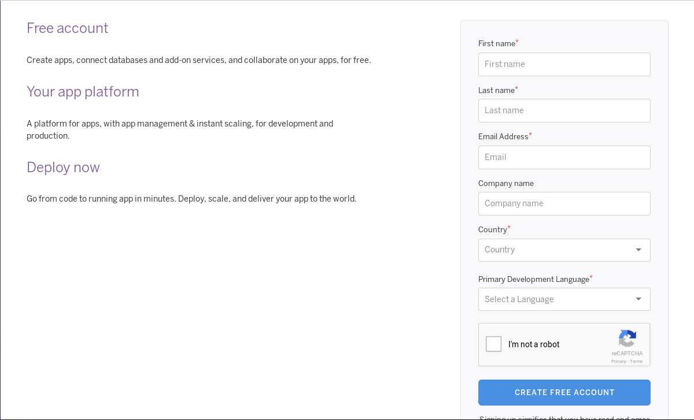

Elegimos el lenguage principal de nuestra aplicación:

Y seguimos la guía hasta el despliegue de la aplicación:

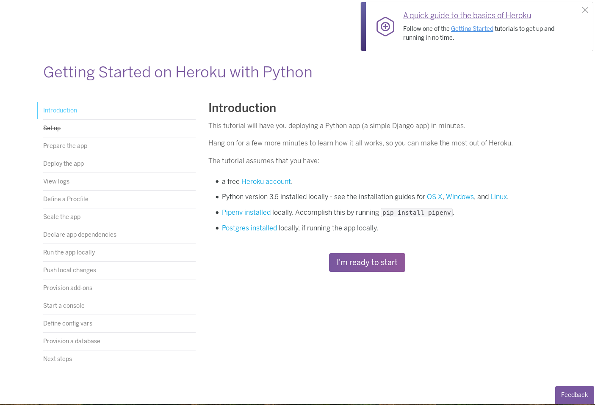

### Ejercicio 2 y 3
**Realizar una app en express (o el lenguaje y marco elegido) que incluya variables como en el caso anterior.**

Para estos ejercicios he elegido un repositorio que ya tenía, [hitos-iv](https://github.com/lulivi/hitos-iv).

### Ejercicio 4
**Crear pruebas para las diferentes rutas de la aplicación.**

Los tests para la aplicación se pueden encontrar en la [carpeta de tests](https://github.com/lulivi/hitos-iv/blob/master/tests/test_hug_hitos_iv.py).

### Ejercicio 5 y 6
**Instalar y echar a andar tu primera aplicación en Heroku.**

Voy a utilizar la aplicación del ejercicio 2, hecha para hitos anteriores.

Para utilizar un repositorio de github y que se despliegue automáticamente la aplicación cada vez que hacemos un push a master, hay que seguír los siguientes pasos.

#### Pruebas en local

Para probar en local antes de conectar el repositorio con github, podemos utilizar el comando

    $ heroku local

Esto ejecutará los comandos proporcionados en el archivo Procfile obteniendo esta salida:

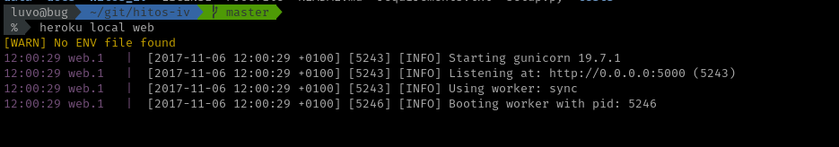

Entonces, accediendo a `localhost:5000` o `0.0.0.0:5000` veremos las salidas de a aplicación.

#### Crear una nueva aplicación de heroku

Nos dirigimos a [nuestro dashboard](https://dashboard.heroku.com/apps) y clicamos en nueva aplicación:

#### Nombre de la aplicación

Introducimos el nombre de nuestra aplicación (en blanco si queremos que nos de un nombre heroku):

#### Desplegado automático con github

Finalmente seleccionamos como método de desplegado `github` y clicamos el desplegado automático:

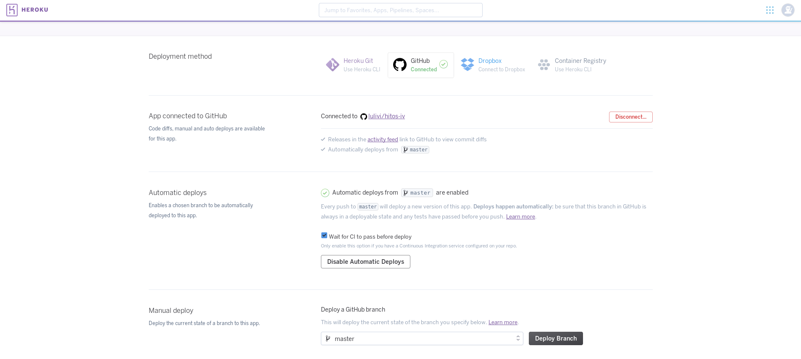

#### Fin!

Puedes acceder a la [aplicación de hitos](https://hitos-iv.herokuapp.com/) y hacer peticiones get a las siguientes rutas:

- `/` - Devolverá un OK
- `/all` - Mostrará el contenido del archivo [hitos.json](https://github.com/lulivi/hitos-iv/blob/master/data/hitos.json)
- `/get/{id}` - Mostará el contenido del hito indicado
- `/number` - Mostrará el número de hitos

### Ejercicio 7 y 8
**Haz alguna modificación a tu aplicación en node.js para Heroku, sin olvidar añadir los tests para la nueva funcionalidad, y configura el despliegue automático a Heroku usando Snap CI o alguno de los otros servicios, como Codeship, mencionados en StackOverflow**

Dado que de primeras he utilizado la integración de travis con github y su conexión con heroku para el auto desplegado, voy a probar otra funcionalidad usando [Heroku pipeline](https://blog.heroku.com/heroku_flow_pipelines_review_apps_and_github_sync#introducing-pipelines) (viene a ser lo mismo que usar [snap CI](https://snap-ci.com/) que se ha dejado de utilizar).

#### Creamos una nueva aplicación en heroku

Esta nueva aplicación será para la producción. Creamos la nueva app y en vez de conectarla con github, le damos a crear una nueva pipeline con ella:

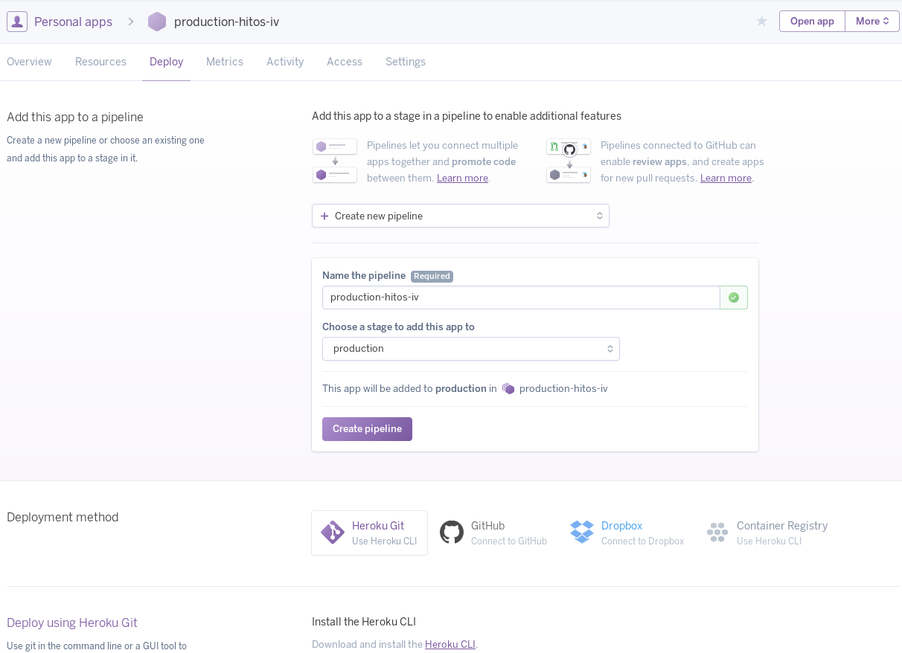

#### Añadimos la staging app

Añadimos la aplicación que ya teníamos de los ejercicios anteriores a pre-producción (staging):

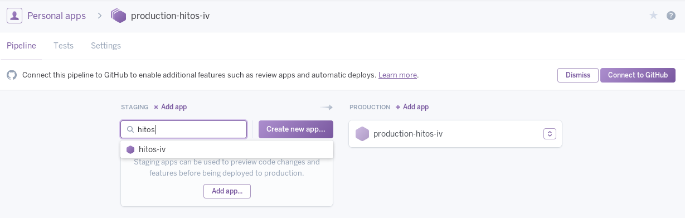

#### Creamos una app-review

Finalmente, indicamos que queremos configurar un revisor de apps cuando nos manden pull requests:
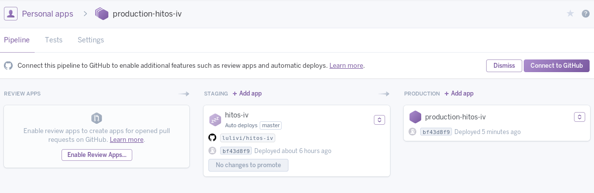

Aceptamos crear:

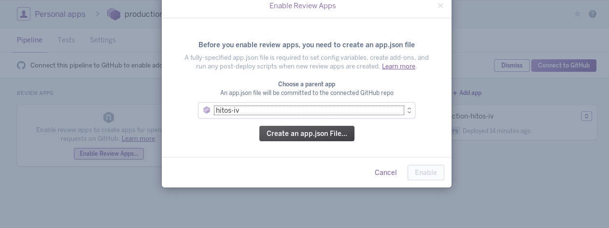

Y la configuramos:

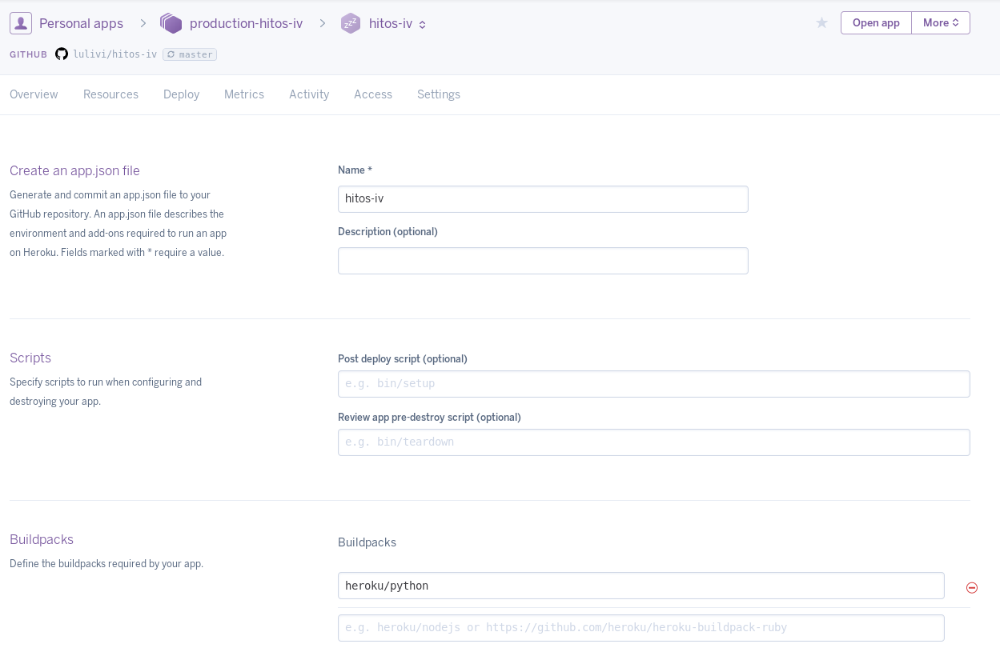

#### Probando app-review

Nos dirigimos a github y hacemos un pull request con alguna modificación a `master`:

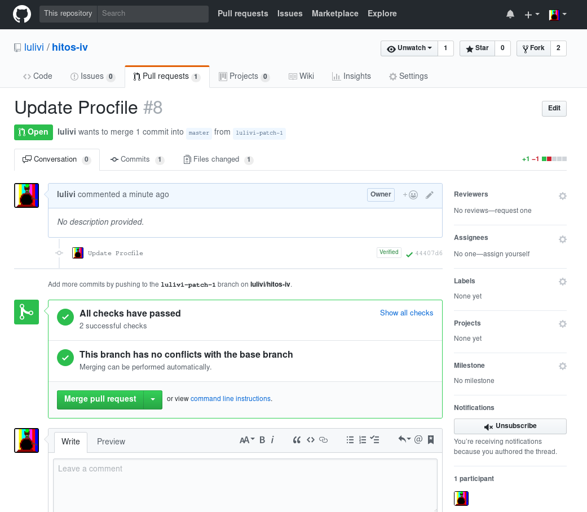

Nos aparecera un apalicación para probarla en la columna izquierda (Review apps). Una vez combinado el patch con el master, desaparece la aplicación y nos encontramos la posibilidad de desplegar a producción la nueva aplicación.

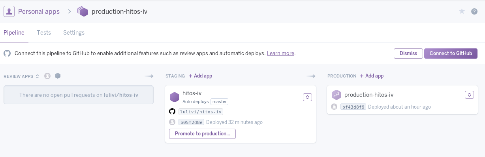
