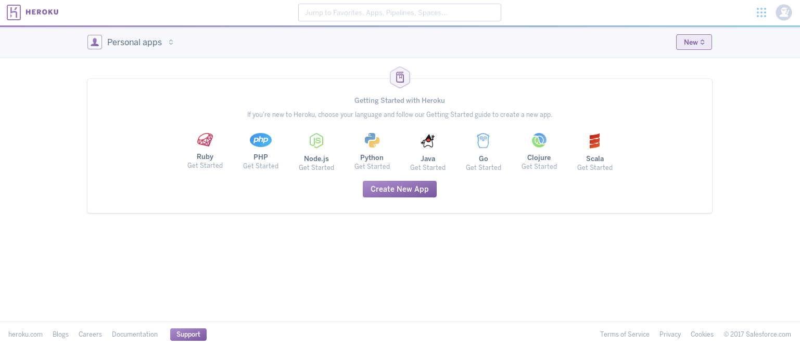

# Ejercicios propuestos del tema 3

## Índice
<!-- TOC depthFrom:3 depthTo:9 withLinks:1 updateOnSave:1 orderedList:0 -->

- [Ejercicio 1](#ejercicio-1)
- [Ejercicio 2 y 3](#ejercicio-2-y-3)
	- [Crear una nueva aplicación de heroku](#crear-una-nueva-aplicación-de-heroku)
	- [Nombre de la aplicación](#nombre-de-la-aplicación)
	- [Desplegado automático con github](#desplegado-automático-con-github)
	- [Fin!](#fin)

<!-- /TOC -->

### Ejercicio 1
**Darse de alta en algún servicio PaaS tal como Heroku, zeit, BlueMix u OpenShift.**

El primer servicio que he elegido ha sido [Heroku](https://www.heroku.com/).

Nos [creamos una cuenta](https://signup.heroku.com/) introduciendo nuestos datos:

Elegimos el lenguage principal de nuestra aplicación:

Y seguimos la guía hasta el despliegue de la aplicación:

### Ejercicio 2 y 3
**Realizar una app en express (o el lenguaje y marco elegido) que incluya variables como en el caso anterior.**

Para estos ejercicios he elegido un repositorio que ya tenía, [hitos-iv](https://github.com/lulivi/hitos-iv).

Para utilizar un repositorio de github y que se auto ejecute la aplicación cada vez que hacemos un push a master, hay que seguír los siguientes pasos.

#### Crear una nueva aplicación de heroku

Nos dirigimos a [nuestro dashboard](https://dashboard.heroku.com/apps) y clicamos en nueva aplicación:

#### Nombre de la aplicación

Introducimos el nombre de nuestra aplicación (en blanco si queremos que nos de un nombre heroku):

#### Desplegado automático con github

Finalmente seleccionamos como método de desplegado `github` y clicamos el desplegado automático:

#### Fin!

Puedes acceder a la [aplicación de hitos](https://hitos-iv.herokuapp.com/) y hacer peticiones get a las siguientes rutas:

- `/` - Devolverá un OK
- `/all` - Mostrará el contenido del archivo [hitos.json](https://github.com/lulivi/hitos-iv/blob/master/data/hitos.json)
- `/get/{id}` - Mostará el contenido del hito indicado
- `/number` - Mostrará el número de hitos
