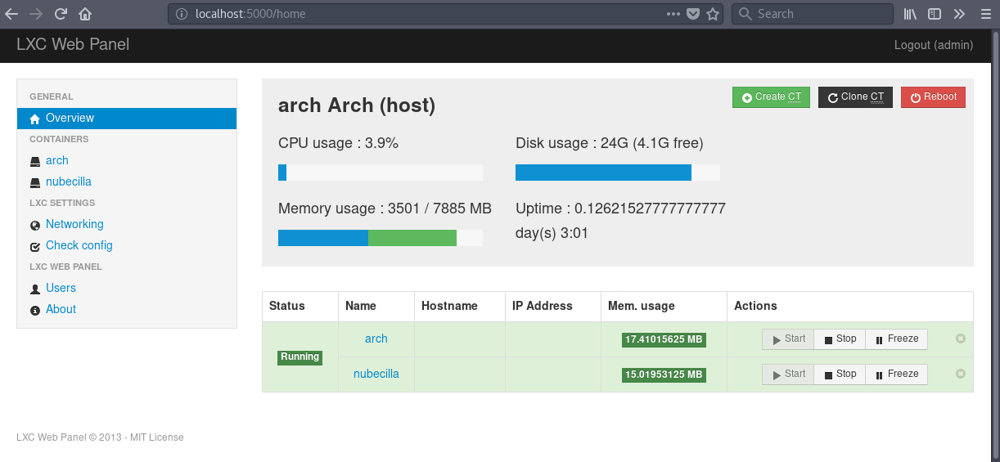

# Ejercicios propuestos del tema 4

## Índice

<!-- TOC depthFrom:3 depthTo:6 withLinks:1 updateOnSave:1 orderedList:0 -->

- [Ejercicio 1](#ejercicio-1)
- [Ejercicio 2: creación y ejecución de contenedores](#ejercicio-2-creación-y-ejecución-de-contenedores)
- [Ejercicio 3: Docker](#ejercicio-3-docker)
- [Ejercicio 4: Instalación de imágenes](#ejercicio-4-instalación-de-imágenes)
	- [Parte 1: Imagenes adicionales](#parte-1-imagenes-adicionales)
	- [Parte 2: Imagen con MongoDB](#parte-2-imagen-con-mongodb)
- [Ejercicio 5: Instalación de servicios](#ejercicio-5-instalación-de-servicios)
- [Ejercicio 6: Imagen persisitente](#ejercicio-6-imagen-persisitente)
- [Ejercicio 7: Dockerfile](#ejercicio-7-dockerfile)
- [Ejercicio 8: Desplegado](#ejercicio-8-desplegado)

<!-- /TOC -->

### Ejercicio 1
**Instala LXC en tu versión de Linux favorita. Normalmente la versión en desarrollo, disponible tanto en GitHub como en el sitio web está bastante más avanzada; para evitar problemas sobre todo con las herramientas que vamos a ver más adelante, conviene que te instales la última versión y si es posible una igual o mayor a la 1.0.**

Buscamos el paquete con el gestor pacman:

	$ pacman -Ss lxc
	community/clxclient 3.9.0-2
			C++ wrapper library around the X Window System API
	community/lxc 1:2.1.1-1
			Linux Containers
	community/lxcfs 2.0.7-1
			FUSE filesystem for LXC

E instalamos el segundo paquete:

	$ sudo pacman -S lxc

### Ejercicio 2: creación y ejecución de contenedores
**Crear y ejecutar un contenedor basado en tu distribución y otro basado en otra distribución, tal como Fedora. Nota En general, crear un contenedor basado en tu distribución y otro basado en otra que no sea la tuya.**

Comandos principales de lxc:

- `$ sudo lxc-list -f`: muestra los contenedores instalados en el sistema.
- `$ sudo lxc-start -n <nombre_conenedor>`: levantar un contenedor.
- `$ sudo lxc-stop -n <nombre_contenedor>`: parar un contenedor.
- `$ sudo lxc-attach -n <nombre_contenedor>`: empezar un proceso dentro de un contenedor.

Para poder crear un contenedor de arch necesitamos instalar el paquete `arch-install-scripts`.

Posteriormente escribimos:

	$ sudo lxc-create -t ubuntu-cloud -n nubecilla
	$ sudo lxc-create -t archlinux -n arch-lxc

Para comprobar que todo está correcto:

	$ sudo lxc-ls -f
	NAME      STATE   AUTOSTART GROUPS IPV4 IPV6
	arch-lxc  RUNNING 0         -      -    -
	nubecilla RUNNING 0         -      -    -

Tambien podemos monitorizarlos por LXC Web Panel:

### Ejercicio 3: Docker
**Instalar docker.**

Como en el primer ejercicio, usamos el gestor de paquetes pacman:

	$ sudo pacman -S docker

### Ejercicio 4: Instalación de imágenes
#### Parte 1: Imagenes adicionales
**Instalar a partir de docker una imagen alternativa de Ubuntu y alguna adicional, por ejemplo de CentOS.**

Descargo la imagen de [Ubuntu](https://hub.docker.com/r/_/ubuntu/):

	$ sudo docker pull ubuntu
	[sudo] password for root:
	Using default tag: latest
	latest: Pulling from library/ubuntu
	660c48dd555d: Pull complete
	4c7380416e78: Pull complete
	421e436b5f80: Pull complete
	e4ce6c3651b3: Pull complete
	be588e74bd34: Pull complete
	Digest: sha256:7c67a2206d3c04703e5c23518707bdd4916c057562dd51c74b99b2ba26af0f79
	Status: Downloaded newer image for ubuntu:latest

#### Parte 2: Imagen con MongoDB
**Buscar e instalar una imagen que incluya MongoDB.**

Para instalar Debian con [MongoDB](https://hub.docker.com/_/mongo/):

	$ sudo docker pull mongo:3.0.15-wheezy
	[sudo] password for root:
	3.0.15-wheezy: Pulling from library/mongo
	0f873bc6703c: Pull complete
	c94a004d7355: Pull complete
	dcfa5a3afb2b: Pull complete
	769e01fbd0e1: Pull complete
	6da4bf642cb3: Pull complete
	fa1b36f4df7f: Pull complete
	cab03bef87d3: Pull complete
	a8c75060a12a: Pull complete
	fbb2eb1e5f3e: Pull complete
	87b47d5e60f5: Pull complete
	40c448308fd1: Pull complete
	844c1628792a: Pull complete
	Digest: sha256:f0e8cd8e3dc16086dc552609623b9951f6cb500282f3c808d75a406a08b999a9
	Status: Downloaded newer image for mongo:3.0.15-wheezy

### Ejercicio 5: Instalación de servicios
**Crear un usuario propio e instalar alguna aplicación tal como nginx en el contenedor creado de esta forma, usando las órdenes propias del sistema operativo con el que se haya inicializado el contenedor.**

### Ejercicio 6: Imagen persisitente
**Crear a partir del contenedor anterior una imagen persistente con commit.**

### Ejercicio 7: Dockerfile
**Crear un Dockerfile para el servicio web que se ha venido desarrollando en el proyecto de la asignatura.**

Para este ejercicio he utilizado mi repositorio de [hitos-iv](https://github.com/lulivi/hitos-iv/blob/master/Dockerfile)

	>Dockerfile
	FROM python

	RUN mkdir -p /usr/src/app
	WORKDIR /usr/src/app/

	COPY requirements.txt /usr/src/app/
	RUN pip install --no-cache-dir -r requirements.txt

	COPY . /usr/src/app

	CMD cd hitos_iv/ && hug -p 80 -f hug_hitos_iv.py

	EXPOSE 80

Una vez creado el archivo, hacemos commit de éste, pues docker utiliza respositorios git.

### Ejercicio 8: Desplegado
**Desplegar un contenedor en alguno de estos servicios, de prueba gratuita o gratuitos.**

Para el desplegado del contenedor he utilizado [Zeit](https://zeit.co/) siguiendo los siguientes pasos:

1. Registrarnos en Zeit.
2. Instalar la herramienta [now](https://zeit.co/download#command-line).
3. [Crear el dockerfile](#ejercicio-7-dockerfile) de nuestra app.
4. Desplegar nuestra app en Zeit con `now --public`.
5. ¡Ya tenemos nuestra app desplegada! Su url nos la indica `now`:

	$ now --public
	> Deploying ~/git/hitos-iv under lulivi
	> Ready! https://hitos-iv-ttaxlimbsx.now.sh [5s]  # <---- Aquí tenemos la url
	> Synced 1 file (231B) [0ms]
	> Initializing…
	> Building
	> ▲ docker build
	Sending build context to Docker daemon 117.2 kBkB
	> Step 1 : FROM python
	> latest: Pulling from library/python
	> Digest: sha256:bd54e27f94bfbe86ffe42690bcce8f33f4972902b529943e71a3226d28e8953a
	> Status: Downloaded newer image for python:latest
	>  ---> 79e1dc9af1c1
	> Step 2 : RUN mkdir -p /usr/src/app
	>  ---> Running in 6d5ddcc60903
	...
	> Removing intermediate container 0347c60661d6
	> Successfully built 6993b1abdc94
	> ▲ Storing image
	> ▲ Deploying image
	> ▲ Container started
	> Deployment complete!
